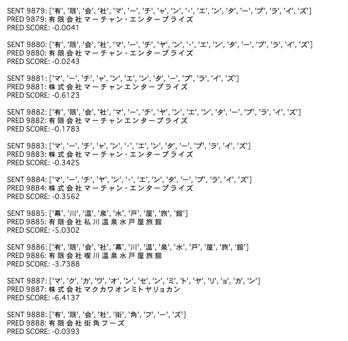

# Encoder-Decoder-JCLdic

Encoder-Decoder model trained by JCLdic[1][2].

- [OpenNMT-py](https://github.com/OpenNMT/OpenNMT-py)[3] is used for Encoder-Decoder model training.
- [JCLdic](https://github.com/chakki-works/Japanese-Company-Lexicon) is "High Coverage Lexicon for Japanese Company Name Recognition".
- This model has a potential for the normalization of company names. The idea is inspired by [the article of Cookpad Developers' Blog](https://techlife.cookpad.com/entry/2017/10/30/080102)[4].



## Insights

1. The normalization of "ヤ" to "ャ" is done.
1. In case that "有限会社" is not explicitly given, "株式会社" is predicted. This may be because it has the highest statistical frequency of occurrence.
1. It should be reasonable to change the task to normalize only pure company names by removing "有限会社", "株式会社" etc. from the training data on the tgt side before-hand.

## Training

[Google Colab](https://colab.research.google.com/)[5] is used for training. 

The root directory is `/content/drive/My Drive/`. `./data/jcl_full_preprocessed.pickle` is a preprocessed pandas.DataFrame created from `JCL_full`. `c0` column contains src text and `c10` column contains tgt text.

```
.
├── data
│   └── jcl_full_preprocessed.pickle
└── experiments
    └── training.ipynb
```

The model.summary() of Encoder-Decoder is shown as follows:

```
NMTModel(
  (encoder): RNNEncoder(
    (embeddings): Embeddings(
      (make_embedding): Sequential(
        (emb_luts): Elementwise(
          (0): Embedding(4634, 500, padding_idx=1)
        )
      )
    )
    (rnn): LSTM(500, 500, num_layers=2, dropout=0.3)
  )
  (decoder): InputFeedRNNDecoder(
    (embeddings): Embeddings(
      (make_embedding): Sequential(
        (emb_luts): Elementwise(
          (0): Embedding(4702, 500, padding_idx=1)
        )
      )
    )
    (dropout): Dropout(p=0.3, inplace=False)
    (rnn): StackedLSTM(
      (dropout): Dropout(p=0.3, inplace=False)
      (layers): ModuleList(
        (0): LSTMCell(1000, 500)
        (1): LSTMCell(500, 500)
      )
    )
    (attn): GlobalAttention(
      (linear_in): Linear(in_features=500, out_features=500, bias=False)
      (linear_out): Linear(in_features=1000, out_features=500, bias=False)
    )
  )
  (generator): Sequential(
    (0): Linear(in_features=500, out_features=4702, bias=True)
    (1): Cast()
    (2): LogSoftmax()
  )
)
```

## Reference

[1] TIS、自然言語処理で企業名認識を行うための辞書「JCLdic」を無償公開 ～ 企業名のカバレッジ範囲が高い辞書で、自然言語処理など多様なシーンでの活用を目指す～, April 20th 2020, https://www.tis.co.jp/news/2020/tis_news/20200420_1.html.  
[2] Japanese Company Lexicon (JCLdic), https://github.com/chakki-works/Japanese-Company-Lexicon.  
[3] OpenNMT-py: Open-Source Neural Machine Translation, https://github.com/OpenNMT/OpenNMT-py.  
[4] Encoder-Decoder でレシピの材料名を正規化する, https://techlife.cookpad.com/entry/2017/10/30/080102.  
[5] Google Colab, https://colab.research.google.com/.  
